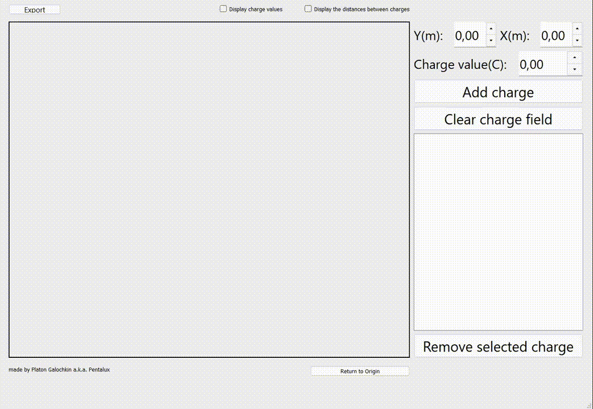

# Electric Field Calculator

An educational tool designed to assist high school educators in demonstrating electrostatics. It enables the accurate and interactive visualization of complex electrical charge systems.

  

## Key Features & Recent Improvements (v 1.0.2)

* **Advanced Numerical Integration:** Upgraded the field line calculation algorithm from Euler's method to the fourth-order Runge-Kutta (RK4) method, significantly enhancing simulation accuracy and optimization.
* **Refined Physics Engine:** Eliminated non-physical overlapping of field lines with charge surfaces, ensuring strict adherence to fundamental electrostatic principles.
* **Analytical Tools:** Introduced real-time distance measurement between charges to seamlessly facilitate Coulomb's Law calculations during demonstrations.
* **Export Capabilities:** Implemented high-quality rendering options to easily save and print charge system visualizations.

## Future Roadmap

* **Electrodynamics:** Introducing kinematics to charges, allowing users to build dynamic systems with charges moving through space-time.
* **Magnetic Fields:** Implementing visualization algorithms for the magnetic field lines generated by these moving charges.

## Technical Details

* **Framework:** Developed using the Qt Framework (Qt Creator) to provide a highly optimized, responsive, and user-friendly graphical interface.
* **Compatibility:** Cross-platform support for Windows (x32/x64) and recent versions of macOS.

---
*Created by P.A. Galochkin (@pentalux). All rights reserved.*
